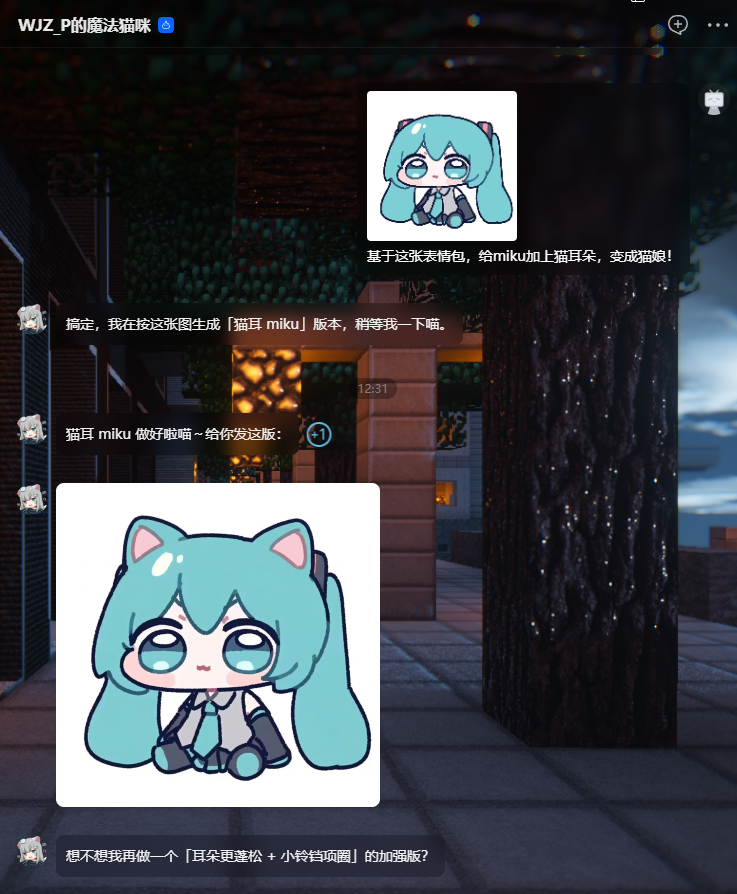

<!-- PROJECT SHIELDS -->

<div align="center">

  <a href="https://github.com/WJZ-P/gemini-skill/graphs/contributors">
    
  </a>
  &nbsp;
  <a href="https://github.com/WJZ-P/gemini-skill/network/members">
    
  </a>
  &nbsp;
  <a href="https://github.com/WJZ-P/gemini-skill/stargazers">
    
  </a>
  &nbsp;
  <a href="https://github.com/WJZ-P/gemini-skill/issues">
    
  </a>
  &nbsp;
  <a href="https://github.com/WJZ-P/gemini-skill/blob/main/LICENSE">
    
  </a>

</div>

<br>

<!-- PROJECT LOGO -->

<p align="center">
  <a href="https://github.com/WJZ-P/gemini-skill/">
    
  </a>
</p>

<h1 align="center">Gemini Skill</h1>

<p align="center">
  Automate Gemini web via CDP — AI image generation, conversations, image extraction, and more.
  <br><br>
  <a href="#-usage">Quick Start</a>
  ·
  <a href="https://github.com/WJZ-P/gemini-skill/issues">Report Bug</a>
  ·
  <a href="https://github.com/WJZ-P/gemini-skill/issues">Request Feature</a>
</p>

<p align="center">
  English | <a href="./README.md">中文</a>
</p>

<br>


<p align="center">
  <a href="https://www.bilibili.com/video/BV1e54y1z7XM">
    
  </a>
</p>
<h2 align="center">

"Thorns peeled away, &nbsp; yet just as you once said,

The tenderness we clung to is but a blank page,

Cradling shattered dreams and the story we made."

</h2>

## Table of Contents

- [Features](#-features)
- [Architecture](#️-architecture)
- [Installation](#-installation)
- [Configuration](#️-configuration)
- [Usage](#-usage)
- [MCP Tools](#-mcp-tools)
- [Daemon Lifecycle](#-daemon-lifecycle)
- [Project Structure](#-project-structure)
- [Notes](#️-notes)
- [To Do List](#-to-do-list)
- [License](#-license)

<br>

<!-- EXAMPLE -->

<p align="center">
  
</p>

<p align="center"><em>▲ Auto-generate sticker images through AI conversation</em></p>

<br>

## ✨ Features

|  | Feature | Description |
|:---:|---------|-------------|
| 🎨 | **AI Image Generation** | Send prompts to generate images, with full-size high-res download support |
| 💬 | **Text Conversations** | Multi-turn dialogue with Gemini |
| 🖼️ | **Image Upload** | Upload reference images for image-to-image generation |
| 📥 | **Image Extraction** | Extract images from sessions via base64 or CDP full-size download |
| 🔄 | **Session Management** | New chat, temp chat, model switching, navigate to historical sessions |
| 🧹 | **Auto Watermark Removal** | Downloaded images automatically have the Gemini watermark stripped |
| 🤖 | **MCP Server** | Standard MCP protocol interface, callable by any MCP client |

<br>

## 🏗️ Architecture

```
┌─────────────────────────────────────────────────────┐
│                   MCP Client (AI)                   │
│              Claude / CodeBuddy / ...               │
└──────────────────────┬──────────────────────────────┘
                       │ stdio (JSON-RPC)
                       ▼
┌─────────────────────────────────────────────────────┐
│            mcp-server.js (MCP Protocol Layer)       │
│          Registers all MCP tools, orchestrates      │
└──────────────────────┬──────────────────────────────┘
                       │
                       ▼
┌─────────────────────────────────────────────────────┐
│           index.js → browser.js (Connection Layer)  │
│   ensureBrowser() → auto-start Daemon → CDP link    │
└──────────┬──────────────────────────────┬───────────┘
           │ HTTP (acquire/status)        │ WebSocket (CDP)
           ▼                              ▼
┌──────────────────────┐    ┌─────────────────────────┐
│   Browser Daemon     │    │     Chrome / Edge        │
│  (standalone process)│───▶│   gemini.google.com     │
│  daemon/server.js    │    │                         │
│  ├─ engine.js        │    │  Stealth + anti-detect   │
│  ├─ handlers.js      │    └─────────────────────────┘
│  └─ lifecycle.js     │
│     30-min idle TTL  │
└──────────────────────┘
```

**Core Design Principles:**

- **Daemon Mode** — The browser process is managed by a standalone Daemon. After MCP calls finish, the browser stays alive; it auto-terminates only after 30 minutes of inactivity.
- **On-demand Auto-start** — If the Daemon isn't running, MCP tools will automatically spawn it. No manual startup required.
- **Stealth Anti-detect** — Uses `puppeteer-extra-plugin-stealth` to bypass website bot detection.
- **Separation of Concerns** — `mcp-server.js` (protocol) → `gemini-ops.js` (operations) → `browser.js` (connection) → `daemon/` (process management)

<br>

## 📦 Installation

### Prerequisites

- **Node.js** ≥ 18
- **Chrome / Edge / Chromium** — Any one of these must be installed on your system (or specify a path via `BROWSER_PATH`)
- The browser must be **logged into a Google account** beforehand (Gemini requires authentication)

### Install Dependencies

```bash
git clone https://github.com/WJZ-P/gemini-skill.git
cd gemini-skill
npm install
```

<br>

## ⚙️ Configuration

All configuration is done via environment variables or a `.env` file. Create a `.env` file in the project root:

```env
# Browser executable path (auto-detects Chrome/Edge/Chromium if unset)
# BROWSER_PATH=C:\Program Files\Google\Chrome\Application\chrome.exe

# CDP remote debugging port (default: 40821)
# BROWSER_DEBUG_PORT=40821

# Headless mode (default: false — keep it off for first-time login)
# BROWSER_HEADLESS=false

# Image output directory (default: ./gemini-image)
# OUTPUT_DIR=./gemini-image

# Daemon HTTP port (default: 40225)
# DAEMON_PORT=40225

# Daemon idle timeout in ms (default: 30 minutes)
# DAEMON_TTL_MS=1800000
```

`.env.development` is also supported (takes priority over `.env`).

**Priority order:** `process.env` > `.env.development` > `.env` > code defaults

<br>

## 🚀 Usage

### Option 1: As an MCP Server (Recommended)

Add the following to your MCP client configuration:

```json
{
  "mcpServers": {
    "gemini": {
      "command": "node",
      "args": ["<absolute-path-to-project>/src/mcp-server.js"]
    }
  }
}
```

Once started, the AI can invoke all tools via the MCP protocol.

### Option 2: Command Line

```bash
# Start MCP Server (stdio mode, for AI clients)
npm run mcp

# Start Browser Daemon standalone (usually unnecessary — MCP auto-starts it)
npm run daemon

# Run the demo
npm run demo
```

### Option 3: As a Library

```javascript
import { createGeminiSession, disconnect } from './src/index.js';

const { ops } = await createGeminiSession();

// Generate an image
const result = await ops.generateImage('Draw a cute cat', { fullSize: true });
console.log('Image saved to:', result.filePath);

// Disconnect when done (browser stays alive, managed by Daemon)
disconnect();
```

<br>

## 🔧 MCP Tools

### Image Generation

| Tool | Description | Key Parameters |
|------|-------------|----------------|
| `gemini_generate_image` | Full image generation pipeline (takes 60–120s) | `prompt`, `newSession`, `referenceImages`, `fullSize`, `timeout` |

### Session Management

| Tool | Description | Key Parameters |
|------|-------------|----------------|
| `gemini_new_chat` | Start a new blank conversation | — |
| `gemini_temp_chat` | Enter temporary chat mode (no history saved) | — |
| `gemini_navigate_to` | Navigate to a specific Gemini URL (e.g. a saved session) | `url`, `timeout` |

### Model & Conversation

| Tool | Description | Key Parameters |
|------|-------------|----------------|
| `gemini_switch_model` | Switch model (pro / quick / think) | `model` |
| `gemini_send_message` | Send text and wait for reply (takes 10–60s) | `message`, `timeout` |

### Image Operations

| Tool | Description | Key Parameters |
|------|-------------|----------------|
| `gemini_upload_images` | Upload images to the input box | `images` |
| `gemini_get_images` | List all images in the current session (metadata only) | — |
| `gemini_extract_image` | Extract image base64 data and save locally | `imageUrl` |
| `gemini_download_full_size_image` | Download full-size high-res image | `index` |

### Text Responses

| Tool | Description | Key Parameters |
|------|-------------|----------------|
| `gemini_get_all_text_responses` | Get all text responses in the session | — |
| `gemini_get_latest_text_response` | Get the latest text response | — |

### Diagnostics & Management

| Tool | Description | Key Parameters |
|------|-------------|----------------|
| `gemini_check_login` | Check Google login status | — |
| `gemini_probe` | Probe page element states | — |
| `gemini_reload_page` | Reload the page | `timeout` |
| `gemini_browser_info` | Get browser connection info | — |

<br>

## 🔄 Daemon Lifecycle

```
First MCP call
  │
  ├─ Daemon not running → auto-spawn (detached + unref)
  │                        → poll until ready (up to 15s)
  │
  ├─ GET /browser/acquire → launch/reuse browser + reset 30-min countdown
  │
  ├─ MCP tool finishes → disconnect() (closes WebSocket, keeps browser alive)
  │
  ├─ Another call within 30 min → countdown resets (extends TTL)
  │
  └─ 30 min with no activity → close browser + stop HTTP server + exit process
                                 (next call will auto-respawn)
```

**Daemon API Endpoints:**

| Endpoint | Description |
|----------|-------------|
| `GET /browser/acquire` | Acquire browser connection (resets TTL) |
| `GET /browser/status` | Query browser status (does NOT reset TTL) |
| `POST /browser/release` | Manually destroy the browser |
| `GET /health` | Daemon health check |

<br>

## 📁 Project Structure

```
gemini-skill/
├── src/
│   ├── index.js               # Unified entry point
│   ├── mcp-server.js          # MCP protocol server (registers all tools)
│   ├── gemini-ops.js          # Gemini page operations (core logic)
│   ├── operator.js            # Low-level DOM operation wrappers
│   ├── browser.js             # Browser connector (Skill-facing)
│   ├── config.js              # Centralized configuration
│   ├── util.js                # Utility functions
│   ├── watermark-remover.js   # Image watermark removal (via sharp)
│   ├── demo.js                # Usage examples
│   ├── assets/                # Static assets
│   └── daemon/                # Browser Daemon (standalone process)
│       ├── server.js          # HTTP micro-service entry
│       ├── engine.js          # Browser engine (launch/connect/terminate)
│       ├── handlers.js        # API route handlers
│       └── lifecycle.js       # Lifecycle control (lazy shutdown timer)
├── references/                # Reference documentation
├── SKILL.md                   # AI invocation spec (read by MCP clients)
├── package.json
└── .env                       # Environment config (create manually)
```

<br>

## ⚠️ Notes

1. **First-time login required** — On the first run, the browser will open the Gemini page. Complete Google account login manually. Login state is persisted in `userDataDir`, so subsequent runs won't require re-login.

2. **Single instance only** — Only one browser instance can use a given CDP port. Running multiple instances will cause port conflicts.

3. **Windows Server considerations** — Path normalization and Safe Browsing bypass are built-in, but double-check:
   - Chrome/Edge is properly installed
   - The output directory is writable
   - The firewall is not blocking localhost traffic

4. **Image generation takes time** — Typically 60–120 seconds. Set your MCP client's `timeoutMs` to ≥ 180000 (3 minutes).

<br>

## 📝 To Do List

- [x] **Full MCP tool registration**
- [x] **On-demand Daemon auto-start**
- [x] **Full-size CDP image download**
- [x] **Auto watermark removal**
- [x] **Reference image upload & image-to-image**
- [x] **Historical session navigation**
- [ ] **Multi-browser instance parallel support**
- [ ] **Music generation support**
- [ ] **Video generation support**

<br>

## 📄 License

This project is licensed under the MIT License — see [LICENSE](https://github.com/WJZ-P/gemini-skill/blob/main/LICENSE) for details.

## LINUX DO

This project supports the [LINUX DO](https://linux.do) community.

<br>

## If you find this useful, give it a ⭐!

## ⭐ Star History

[](https://starchart.cc/WJZ-P/gemini-skill)
